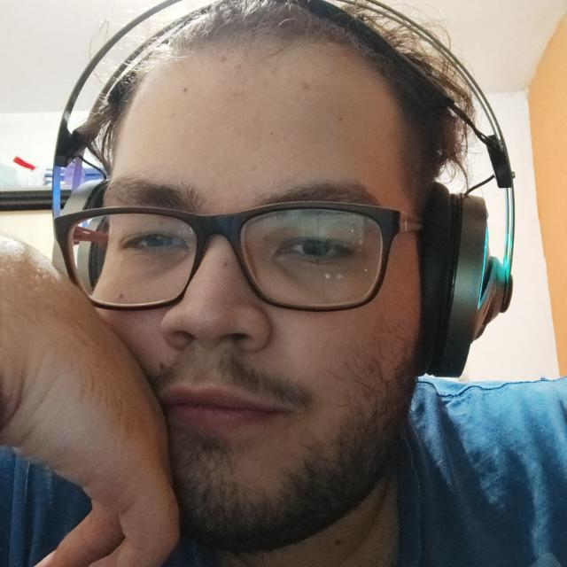
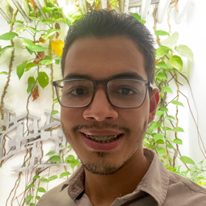

# Desafio Obesidade Infantil - Time 15 

## Integrantes:

  
   
  
  
  

<a href= "https://github.com/coloque seu github aqui"> @Fernanda </a>
@João
@Sol
@Mikael
@adalberto

# Ideas

<a href = "https://miro.com/app/board/o9J_khtMfM0=/">Miro Files</a>

# Resources

 <a href= "https://c3js.org/gettingstarted.html"> Gráfico </a> 
 <a href="https://global.rethinkobesity.com/patients.html#section-weight-management-goals"> Exemplo de questionário </a> 
 <a href="https://www.scielo.br/scielo.php?script=sci_arttext&pid=S0034-71672010000100012"> Fatores de Risco para a Criança Pesquisa sobre Obesidade</a> 

